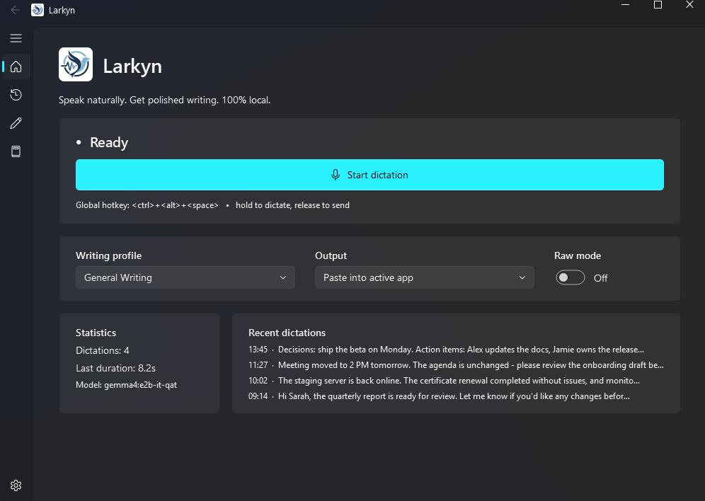

# Larkyn

A privacy-first, system-wide **voice-to-writing** assistant for Windows 11. Press a
hotkey, speak naturally, press again — Larkyn transcribes your speech locally with
Whisper, rewrites it into polished written text with a local LLM
(**`gemma4:e2b-it-qat`** via Ollama), and pastes it straight into whatever app you're
in. It is **not** a transcription tool; it turns rambling speech into clean writing.

Everything runs on your machine. No telemetry, no analytics, no data leaves the box.



```
Audio ─▶ Whisper ─▶ Raw Transcript ─▶ gemma4:e2b-it-qat ─▶ Final Written Output
```

## Features

- **Global hotkey dictation** — works in Outlook, Teams, Word, Notepad, VS Code,
  browsers, anywhere. Two behaviors (Settings → Global hotkey): **hold to talk**
  (record while the combo is held, process on release — the default) or
  **toggle** (press to start, press again to stop). Any combo works, including
  modifier-only ones like Ctrl+Win.
- **Local GPU Whisper** (faster-whisper, CUDA float16 with automatic CPU fallback).
- **Fast local rewriting** with `gemma4:e2b-it-qat` over Ollama's native API —
  model "thinking" disabled for ~3s end-to-end on short dictations. Any
  OpenAI-compatible endpoint (LM Studio, llama.cpp, vLLM, OpenAI…) also works.
- **Fluent (Windows 11) app window** — Home dashboard with live dictation control,
  searchable History, Profile manager, Vocabulary editor, full Settings with
  live-apply (no restart needed).
- **7 writing profiles** (General, Email, Technical Documentation, Meeting Notes,
  Executive Summary, Clinical Documentation, IT Operations) + unlimited custom
  profiles. Profiles change prompting only — same model.
- **Personal vocabulary** — your product names and jargon are always preserved;
  Whisper mis-hearings are corrected back to your exact spelling.
- **Smart spoken commands** — "new paragraph", "new line", "bullet point",
  "heading …", "scratch that".
- **Output modes** — auto-paste, clipboard-only, or draft; plus Raw Mode.
- **Local history** — SQLite + full-text search.
- **System tray** — single-click to dictate, double-click to open the window.

## Install (end users)

First-time setup takes about 10 minutes, most of it downloads. Larkyn needs one
companion program — **Ollama** — which runs the AI model locally on your PC.

**Step 1 — Install Ollama.** Download it from
[ollama.com/download](https://ollama.com/download) (Download for Windows) and run
`OllamaSetup.exe`. It runs quietly in the background afterwards — nothing to configure.

**Step 2 — Download the AI model** (one time, ~4.3 GB). Open PowerShell
(Windows key → type `powershell` → Enter) and run:

```powershell
ollama pull gemma4:e2b-it-qat
```

Confirm with `ollama list` — you should see `gemma4:e2b-it-qat` listed.

**Step 3 — Install Larkyn.**
**[⬇ Download the latest installer from Releases](https://github.com/dodaniel351/Larkyn/releases/latest)**
(`LarkynSetup.exe`, ~1.9 GB — bundles the full runtime and CUDA libraries so it
works offline). Run it and follow the wizard — no admin rights needed. If Windows
SmartScreen warns (the installer isn't code-signed yet), click **More info → Run anyway**.

**Step 4 — Dictate.** Launch Larkyn from the Start menu. The very first dictation
downloads the speech-recognition model (~1.6 GB, one time); after that it's instant.
Click into any text box, **hold `Ctrl+Alt+Space`, speak, release** — polished text
appears at your cursor. Pick your own hotkey and behavior in **Settings → Global
hotkey**, and use **Settings → AI model → Test connection** to verify your setup.

## Run from source (developers)

```powershell
git clone https://github.com/dodaniel351/Larkyn.git
cd Larkyn
python -m venv .venv
.\.venv\Scripts\python.exe -m pip install -r requirements.txt
.\.venv\Scripts\python.exe -m pip install -r requirements-gpu.txt   # NVIDIA GPUs
.\.venv\Scripts\python.exe run.py        # or double-click run-larkyn.bat
```

Requires Python 3.10+ on Windows 11.

> ⚠️ Use the venv interpreter explicitly. A bare `python run.py` with another
> Python first on PATH will fail with `ModuleNotFoundError: No module named 'PySide6'`.

## Build the installer

```powershell
.\.venv\Scripts\python.exe scripts\process_logo.py       # regenerate icon from assets\logo.png (optional)
.\.venv\Scripts\pyinstaller.exe larkyn.spec --noconfirm  # dist\Larkyn\
ISCC.exe installer\larkyn.iss                            # dist\installer\LarkynSetup.exe
```

## Configuration

Config and data live in `%APPDATA%\Larkyn\` (`config.json`, `history.db`,
`larkyn.log`). Everything is editable from the in-app **Settings** page; changes
apply live. Default model configuration:

```json
{
  "provider": "ollama",
  "endpoint": "http://localhost:11434/v1",
  "model": "gemma4:e2b-it-qat",
  "temperature": 0.2,
  "top_p": 0.9,
  "max_tokens": 4096,
  "think": false
}
```

Switching to another model/provider is a Settings change — no code edits.

## Architecture

Modular, swappable plugins behind abstract interfaces (`larkyn/core/interfaces.py`),
wired by an `Orchestrator` that runs the pipeline off the UI thread:

| Component | Module | Backend |
|---|---|---|
| Audio capture | `larkyn/audio/capture.py` | sounddevice |
| Speech-to-text | `larkyn/stt/faster_whisper_engine.py` | faster-whisper |
| Prompt engine | `larkyn/prompt/` | profiles + vocabulary + smart commands |
| LLM rewrite | `larkyn/llm/` | Ollama native / OpenAI-compatible |
| Output | `larkyn/output/sink.py` | clipboard / auto-paste / draft |
| History | `larkyn/history/store.py` | SQLite + FTS5 |
| UI | `larkyn/ui/` | PySide6 + Fluent widgets |

## Troubleshooting

All activity is logged to `%APPDATA%\Larkyn\larkyn.log`. After launching,
it should contain `Tray icon shown` and `Global hotkey registered`. Each hotkey
press logs `Hotkey toggle received`, then `Processing … samples`, `Transcript: …`,
and `Delivered …`. If a press logs nothing, the hotkey was intercepted by another
app — change it in Settings or click the tray icon.

## Tests

```powershell
.\.venv\Scripts\python.exe -m pytest
```
